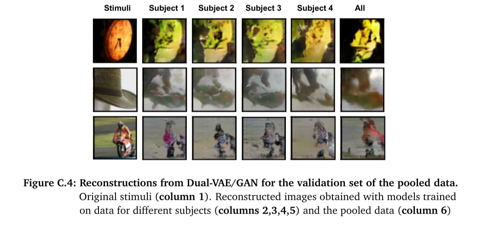
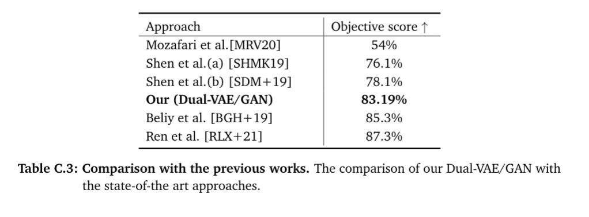
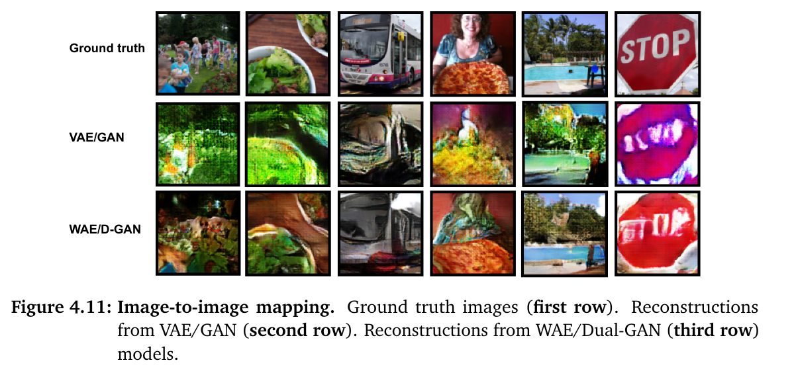

# Image reconstruction from human brain activity 
#### Image reconstruction from human brain activity by variational autoencoding and adversarial learning

Image reconstruction from human brain activity is one of the central problems in brain decoding
towards reproducing mental content and exploring the human visual system contributing to the
detection and prevention of visual diseases. For the past few years, significant achievements
in the fields of functional Magnetic Reasoning Imaging (fMRI) and artificial intelligence (AI)
facilitated researchers to explore the human brain on a new level. The problem of reconstruction
from fMRI is characterized by two main challenges. On the one hand, there is a huge gap
between visual and fMRI data domains. On the other hand, existing datasets provide only scarce
image-fMRI pairs. Due to these two limitations, obtaining high-quality reconstructions from brain
activity is still an open problem. The research objective of this thesis is to reconstruct natural
visual stimuli from human brain activity recorded by fMRI. For this purpose, we implement
the framework based on a variational autoencoder (VAE) and generative adversarial networks
(GANs), which demonstrated promising results in reconstruction tasks in various domains. In
order to overcome the challenges for image-fMRI domains, we use a 3-stage training procedure
and apply the dataset, which includes more stimuli, in comparison to those used in previous
studies. We study the VAE weakness connected with its latent space regularization and show
that the Wasserstein autoencoder (WAE) is able to overcome this problem. We also train WAE
with two discriminators and demonstrate the advantages of the obtained model, which is called
WAE/Dual-GAN, in the image-to-image translation task.


## Requirements
* Python 3.6.11
* PyTorch 1.4.0
* Torchvision 0.5.0
* Tensorboard 2.4.1
* Numpy 1.19.2
* Pandas 1.1.3
* Matplotlib 3.3.2

You can find more details in [environment.yml](environment.yml) (not all packages are used in the project).

## Project description and structure

* **configs**: includes all config files
* **data_preprocessing**: all python scripts for data preparation
* **docs**: some results   
* **experiments**: some additional code for experiments (less important)
* **inference**: includes the scripts for inefernce
* **models**: here we define model architectures
* **train**: scripts used for training (more important)
* **user study**: includes the user study result and its evaluation 
* **voxel2pixel:** attempt to reproduce the paper result

## Configs:
* ```data_config.py:``` configurations of datasets i.e. paths, subjects.
* ```models_config.py:```  model architecture
* ```gan_config.py:``` dual-vae/gan (inc. wae/dual-gan) training parameters
* ```wae_config.py:``` wae/gan training parameters
* ```inference_config.py:``` parameters for inference

## Environment Setup

In oder to run the code we recommend to set up conda environment. 

1. Install miniconda 
 * ```wget --user - https://repo.anaconda.com/miniconda/Miniconda3-latest-Linux-x86_64.sh```
 * ```sh Miniconda3-latest-Linux-x86_64.sh```
2. Create environment. Use -p to be able to specify an absolute path to your new environment. 
   This command installs python 3.6 and pip. 
   
  ```
  conda create -p /path/to/environment python=3.6 pip
  ```
     
3. Install dependencies using conda as necessary, e.g.

  ```
  conda install pytorch==1.4.0 cudatoolkit=10.1 -c pytorch
  ```

## Data Setup

See details in [data preprocessing](data_preprocessing).

Data used in the thesis are available [here](https://drive.google.com/drive/folders/1yftoRrlOOb1INTxs2Jcq5bMKICI5VwQ5?usp=sharing). 
If you want to use them you have to modify stimuli paths. It is better to prepare the directory with the similar structure following the described steps. 

Once you prepare the data you will be ready to start training.


## Models

* **Config file:** ```config/models_config.py``` 
  - Includes model parameters, e.g. channels in convolutional layers:
    ```python
    encoder_channels = [64, 128, 256]
    decoder_channels = [256, 128, 32, 3]
    discrim_channels = [32, 128, 256, 256, 512]
    ```
    Other parameters:
    ```python
    kernel_size = 5
    stride = 2
    padding = 2
    dropout = 0.7
    ```
* **Architectures:** ``vae_gan.py``
    Here we describe:
    - Visual encoder
    - Cognitive encoder 
    - Decoder
    - Discriminator
    - WAE Discriminator
    - VAE/GAN for image-to-image mapping (Stage I)
    - Cognitive VAE/GAN used with the cognitive encoder (Stage II, III)
    - WAE/GAN (Stage I)
    - Cognitive WAE/GAN (Stage II, III)
    
## Training

We apply the 3-stage training procedure to reconstruct images from fMRI:
* **Stage I:** image-to-image mapping
* **Stage II:** fMRI-to-image with the fixed decoder
* **Stage III:** fMRI-to-image with the fixed cognitive encoder
See details in [train](train).

## Inference

**Config:** ```configs: inference_config.py```

* Data for inference:
  
    ```python
    train_data = 'BOLD5000/bold_train/bold_CSI4_pad.pickle'
    valid_data = 'BOLD5000/bold_train/bold_CSI4_pad.pickle' 
    ```
  
*  Path to the pretrained model with the folder name and epoch number:
    
    ```python
    folder_name = 'gan_cog_3st'
    pretrained_gan = 'gan_cog_3st_20210310-214859'  # all
    load_epoch = 195
    ```
   
* Some more parameters:
    ```python
    dataset = 'coco'       # 'bold' or 'coco'
    evaluate = True        # True if you want evaluate
    save = False           # True to save images
    save_to_folder = None  # specify folder name if you want to save in specific directory
    file_to_save = None    # save .csv file with results
    ```
  
**Run inference**
    
```python
python3 inference/inference_gan.py -i [user path 1]-o [user path 2] -l [path to logs]
```
Flags:
* ``` -i [user path 1]``` user path where datasets are located 
* ``` -o [user path 2]``` user path to save the results
* ``` -l [path to logs]``` path to save logs

## Demo 

1. Prepare the data directory similar to this: [BOLD5000](https://drive.google.com/drive/folders/1yftoRrlOOb1INTxs2Jcq5bMKICI5VwQ5?usp=sharing)
with the same names. See details in [data_preprocessing](data_preprocessing) or just download these data files.
   
1. Set data path in ```configs/inference_config.py```
```python
train_data = 'BOLD5000/bold_train/bold_CSI4_pad.pickle'
valid_data = 'BOLD5000/bold_train/bold_CSI4_pad.pickle'
```
2. Download any pre-trained model. The models are available here:
* [all subjects](https://drive.google.com/file/d/1BBObh7_QK0Fhq06z-Jnm2vGpVXN1LZIJ/view?usp=sharing)
* [subject 1](https://drive.google.com/file/d/1MxoNCPQfoeIL2bbSXa9H05w7sZ68FVHO/view?usp=sharing)
* [subject 2](https://drive.google.com/file/d/1YSc0JXAwgStx1uHWxvtafezyoWudyuB_/view?usp=sharing)
* [subject 3](https://drive.google.com/file/d/1hpoN5Yqm5ZCCwWvrq7LTSNm1l0jOHlYV/view?usp=sharing)
* [subject 4](https://drive.google.com/file/d/1UJQB_C5fdZI3XlcuglrwhAL6kBH8VZNy/view?usp=sharing)

3. Save it in the directory:
* ```[user_path 2]/[save_training_results]/[folder_name]/[pretrained_gan]/```


* E.g.```[user_path 2]/results/gan_cog_3st/gan_cog_3st_20210310-214859/gan_cog_3st_20210310-214859_195.pth```

4. Use settings:

```python
"""_______________Dual-VAE/GAN  Stage III resolution 64____________________"""

dataset = 'bold'       # 'bold' or 'coco'
mode = 'vae-gan'       # vae, wae-gan, vae-gan

folder_name = 'gan_cog_3st'
pretrained_gan = 'gan_cog_3st_20210310-214859'  # all
# pretrained_gan = 'gan_cog_3st_20210310-215029'  # subject 1
# pretrained_gan = 'gan_cog_3st_20210310-215143'  # subject 2
# pretrained_gan = 'gan_cog_3st_20210310-215244'  # subject 3
# pretrained_gan = 'gan_cog_3st_20210310-215345'  # subject 4
load_epoch = 195
```

5. Run inference
    
```python
python3 inference/inference_gan.py -i [user path 1] -o [user path 2] -l [path to logs]
```

6. Let's save images 

```python
evaluate = False       # True if you want to evaluate
save = True         # True to save images
save_to_folder = None  # specify folder name if you want to save in specific directory
file_to_save = None    # save .csv file with results
```

7. Results will be saved in the folder: ``[user_path]/results/inference/inferece_[timestemp]/``

## Some reconstruction examples

### Dual-VAE/GAN 

#### Resolution 64


<div align="center">
    
</div>

* Comparison of our model trained with BOLD5000 and the state-of-the art approaches trained with Generic Object Decoding dataset:

<div align="center">
    
</div>

  
We achieved comparable results with the presented previous works.


### VAE/GAN vs WAE/Dual-GAN

* For image-to-image mapping (Stage I)

<div align="center">
    
</div>


### Pre-trained models

Pre-trained model are available [here](https://drive.google.com/drive/u/1/folders/1Np9DWXMgOAVSn9JxXJn9hP3cShKpmgbx)

From the thesis:

* [Experiment 1](https://drive.google.com/drive/folders/1qxV23MtsHoKzx9DHVbrNE1qbnQ5AzmTN?usp=sharing): Dual-VAE/GAN
  * Stages I, II, III for resolution 64
  * Stages I, II, III for the higher resolution: ```image_size=100, latent_dim=512```
  

* [Experiment 2](https://drive.google.com/drive/folders/1CpOr6xrQV-tcBa0YaD0_ScT4KO5qzzli?usp=sharing): Supervised Training
  * Decoder 
  * VAE
  

* [Experiment 3](https://drive.google.com/drive/folders/1n3smdABMOGzmxu38yCDDXcI3HO9ZY65t?usp=sharing): Adversarial Learning
  * Dual-VAE
  

* [Experiment 4](https://drive.google.com/drive/folders/1Fzz2Pi2FuF-ZRGfDgcriqdweZyr3rFjk?usp=sharing): Visual Encoder (mode collapse)


* [Experiment 5](https://drive.google.com/drive/folders/191AoCedqFlgj5__qiyw2GkfjDKWojQvW?usp=sharing): WAE/GAN
  * Stage I, II, III
  

* [Experiment 6](https://drive.google.com/drive/folders/1q0S_DzKcijUPUWxsbqF0pnzp1DX12rUt?usp=sharing): WAE/Dual-GAN 
  ```image_size=100, latent_dim=512``` Stage I (image-to-image)
  * VAE/GAN 
  * WAE/Dual-GAN

## References

1. Beliy et al. - From voxels to pixels and back: Self-supervision in natural-image reconstruction from fMRI, 2019 [github](https://github.com/WeizmannVision/ssfmri2im)
2. Chang et al. -  BOLD5000, a public fMRI dataset while viewing 5000 visual images, 2019 [github](https://github.com/nchang430/BOLD5000-Scripts)
3. Horikawa et al. - Generic decoding of seen and imagined objects using hierarchical visual features, 2015 [github](https://github.com/KamitaniLab/GenericObjectDecoding)
4. Larsen et al. - Autoencoding beyond pixels using a learned similarity metric, 2016
5. Mozafari et al. - Reconstructing Natural Scenes from fMRI Patterns using BigBiGAN, 2020
6. Ren et al. - Reconstructing Perceived Images from Brain Activity by Visually-guided Cognitive Representation and Adversarial Learning, 2019
7. Shen et al. - Deep image reconstruction from human brain activity, 2019
8. Shen et al. - End-to-End Deep Image Reconstruction From Human Brain Activity, 2019
9. Tolstikhin et al. - Wasserstein Auto-Encoders, 2019 [github](https://github.com/tolstikhin/wae)

**Repositories:**

1. BOLD5000 Data Aggregation https://git.hcics.simtech.uni-stuttgart.de/collaboration-projects/bold5000
2. VAE/GAN: https://github.com/lucabergamini/VAEGAN-PYTORCH
3. WAE/GAN: https://github.com/schelotto/Wasserstein-AutoEncoders
